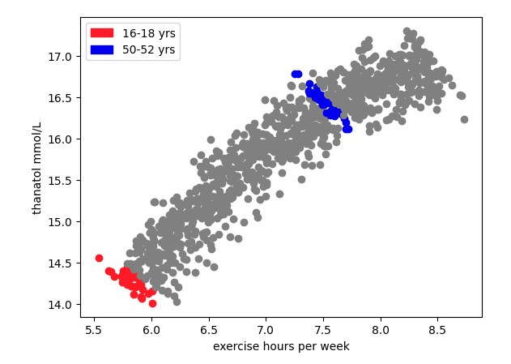

### Overview

Nos encontramos en un mundo ficticio en el cual han descubierto que una molécula hasta ahora desconocida, el **thanatol**, es un excelente predictor de mortalidad cardiovascular: altas concentraciones de thanatol en sangre están asociadas a altas tasas de infartos de miocardio.

Tenemos los datos de un [estudio observacional](https://en.wikipedia.org/wiki/Observational_study) que pretende investigar la relación entre el ejercicio físico y el nivel de thanatol en sangre. La idea es investigar si hay recomendaciones que puedan hacer los médicos a sus pacientes en base a los resultados del estudio.

Una base de datos de sqlite en el fichero [dataset_3.sql](dataset_3.sql) contiene los datos del estudio.

Los datos de los participantes adultos se han recogido en las siguientes tablas:

* `data_collection_day` contiene la fecha de la realización del estudio para los participantes adultos
* `participants` contiene los ids de los participantes adultos
* `ages` contiene las fechas de nacimiento de los participantes adultos
* `exercise` contiene las horas de ejercicio por semana medias que realizan los participantes adultos
* `thanatol` contiene el nivel de thanatol medido en sangre del paciente, en milimoles por litro

Mientras que los datos de los participantes menores de edad se han recogido con otra metodología en la tabla `pediatric`, que contiene columnas:

* `age`: edad en años en el momento del estudio (puede ser fraccional)
* `hours_per_day`: horas de ejercicio por día medias que realiza el participante
* `mmol_per_l`: el nivel de thanatol medido en sangre del paciente, en milimoles por litro

#### ejercicio 1

Queremos combinar los datos de los pacientes adultos y menores de edad para poder tratarlos de forma homogénea.

Crea una view que contenga las siguientes columnas para todos los participantes, tanto menores como adultos:

* age: edad del participante en años en el momento del estudio
* hours_per_week: horas de ejercicio por semana medias que realiza el participante
* mmol_per_l: el nivel de thanatol medido en sangre del paciente, en milimoles por litro

#### ejercicio 2

Exporta esta vista en un csv para poder tratar los datos cómodamente desde otras herramientas, ej. R.

#### ejercicio 3

Nuestros epidemiólogos sospechan que la gente suele hacer más ejercicio físico a medida que se hacen más mayores y responsables.

1. ¿Puedes crear una visualización para aclarar la relación entre la edad y ejercicio físico por semana?
2. ¿Qué tipo de relación observas entre la edad y el ejercicio físico?

#### ejercicio 4

La Dra. Sánchez está tremendamente excitada porque cree haber descubierto una relación importantísima entre la cantidad de ejercicio y el thanatol en sangre.

Quiere:
* publicar un paper en Nature exponiendo la asociación positiva entre ejercicio y thanatol en sangre
* recomendar a todos sus pacientes que dejen de hacer ejercicio inmediatamente

Pero la Dra. Sánchez es una científica responsable así que antes quiere que le eches un vistazo a los datos para confirmar:

1. ¿Puedes crear una visualización para aclarar la relación entre ejercicio físico por semana y nivel de thanatol en sangre?
2. ¿Estás de acuerdo con la Dra. Sánchez que hay una correlación fuerte positiva entre ejercicio físico y nivel de thanatol en sangre?
3. ¿Crees que es buena idea recomendar a los pacientes de la Dra. Sánchez que dejen de hacer ejercicio inmediatamente?

#### ejercicio 5

La Dra. Simpson es pediatra, y ha estado fijándose en los datos de los participantes que tienen menos de 18 años. También está tremendamente excitada porque cree haber descubierto una relación importantísima entre la cantidad de ejercicio y el thanatol en sangre en pacientes jóvenes.

Quiere:
* publicar un paper en Nature exponiendo la asociación negativa entre ejercicio y thanatol en sangre en pacientes jóvenes
* recomendar a todos sus pacientes que empiecen a hacer ejercicio inmediatamente

La Dra. Simpson también es una científica responsable así que antes quiere que le eches un vistazo a los datos para confirmar:

1. ¿Puedes crear una visualización para aclarar la relación entre ejercicio físico por semana y nivel de thanatol en sangre para menores de 18 años?
2. ¿Estás de acuerdo con la Dra. Simpson que hay una correlación fuerte negativa entre ejercicio físico y nivel de thanatol en sangre para menores de 18 años?
3. ¿Crees que es buena idea recomendar a los pacientes de la Dra. Simpson que empiecen a hacer ejercicio inmediatamente?

#### ejercicio 6

La Dra. Nemtsova estaba en la mesa de al lado y ha escuchado las conversaciones tanto con la Dra. Sánchez como con la Dra. Simpson.

Además la Dra. Nemtsova está preocupada por la salud de sus padres, que tienen 50 y 52 años.

Después de escuchar los argumentos de la Dra. Sánchez iba a recomendarles que dejasen de hacer ejercicio inmediatamente, pero al escuchar a la Dra. Simpson decidió usar su metodología y restringir su análisis a la franja de edad de 50 a 52 años: ha descubierto que en esta franja de edad hay una correlación negativa muy fuerte entre ejercicio físico y nivel de thanatol en sangre. Ahora no sabe que recomendar.

La Dra. Nemtsova es una científica responsable; se ha dado cuenta de que hay algo que no entiende y ha empezado a probar cosas a ver si encuentra una explicación. Ha decidido visualizar a la vez los datos disponibles a ver si algo le salta a la vista, y ha pintado:

* el conjunto de datos total
* el conjunto de datos de 16-18 años
* el conjunto de datos de 50-52 años

En efecto, parece obvio a simple vista que hay una correlación positiva entre ejercicio y thanatol en el conjunto de datos total, y correlaciones negativas en los conjuntos de datos de 16-18 y 50-52.

1. Crea una visualización idéntica usando tus herramientas para confirmar que la Dra. Nemtsova no se ha equivocado al crear la visualización
2. Si te fijas en cualquier franja de edad de 2 años eg. 20-22, ¿siempre se observa una correlación negativa?
3. A la Dra. Simpson le suena que un antepasado suyo, un estadístico inglés, observó un fenómeno similar y publicó al respecto. ¿Puedes encontrar el nombre del fenómeno que estamos observando?
4. ¿Deberíamos recomendar a la gente que haga menos ejercicio? ¿Más ejercicio? ¿Otra cosa?
