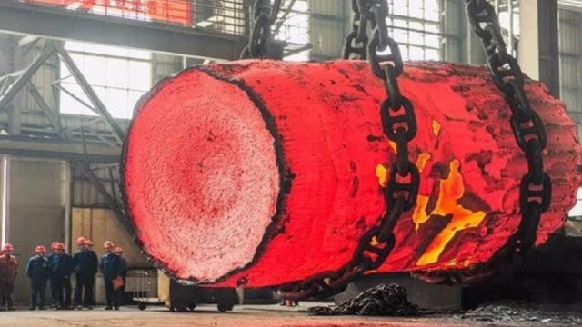

* [Ejercicio](#Ejercicio)
  * [Pregunta 0](#Pregunta-0)
  * [Pregunta 1](#Pregunta-1)
  * [Pregunta 2](#Pregunta-2)
  * [Pregunta 3](#Pregunta-3)
* [Herramientas conceptuales](#Herramientas-conceptuales)
* [Herramientas de implementación](#Herramientas-de-implementación)
* [Presentación de soluciones](#Presentación-de-soluciones)

## Ejercicio

Trabajamos en una fábrica que fabrica Trastos:

Nadie sabe exactamente para qué sirven, pero son enormes y cuesta mucho fabricarlos.

El proceso de fabricación de un Trasto pasa por los siguientes pasos:

1. Calentamiento: un trozo de metal inmenso se calienta hasta ponerlo al rojo vivo, coste: 1000 euros
2. Forjado: el trozo de metal se martillea en una forja hidráulica hasta que adquiere la forma adecuada, coste: 10 euros
3. Inspección: un robot inspecciona el Trasto para ver si cumple las especificaciones
   - si la inspección tarda menos de 13 minutos y se encuentra un defecto, vuelve al paso 2, el martilleo lo mantendrá caliente
   - si la inspección tarda más de 13 minutos y se encuentra un defecto, se ha enfriado demasiado y hay que volver al paso 1

   coste de la inspección: 5 euros

La tasa de error en el forjado es del 20%: un 20% de forjados salen defectuosos y hay que volver a intentarlo.

Estamos evaluando 2 robots distintos para llevar a cabo la inspección, y para compararlos hemos medido lo que tardan en inspeccionar bastantes trastos cada uno con modelos que nos han prestado los fabricantes:

* robot A: tiempos para inspeccionar 889 trastos en [robot_A.csv](robot_A.csv)
* robot B: tiempos para inspeccionar 912 trastos en [robot_B.csv](robot_B.csv)

Los robots valen exactamente lo mismo. Los tiempos de cada inspección son independientes de la presencia de un defecto, del trasto inspeccionado o de lo que tardó la inspección anterior.

### Pregunta 0

¿Qué robot tarda menos de media en inspeccionar un Trasto?

### Pregunta 1

¿Cómo podemos representar visualmente los datos para sacar conclusiones útiles? Usa el notebook.

### Pregunta 2

¿Qué robot debemos de comprar para minimizar los costes de producción?

### Pregunta 3

* ¿Cuál es el coste medio de fabricación por Trasto si usamos inspectores humanos que *siempre* tardan más de 20 minutos en inspeccionar un Trasto? Una inspección humana también cuesta 5 euros.
* ¿Cuál es el coste medio de fabricación por Trasto si usamos el robot A?
* ¿Cuál es el coste medio de fabricación por Trasto si usamos el robot B?

## Herramientas conceptuales

Como siempre que tengamos datos de este tipo, vamos a usar las herramientas estándar para echarles un vistazo:

* Comparamos [histogramas](https://en.wikipedia.org/wiki/Histogram)
* Comparamos cuartiles y min-max, ej. pintando un [box plot con whiskers](https://en.wikipedia.org/wiki/Box_plot)

Podemos usar [experimentos de Monte Carlo](https://en.wikipedia.org/wiki/Monte_Carlo_method) para estimar esperanzas con respecto a la tasa de fallo.

También podemos examinar [la estructura del problema de calcular la esperanza](https://en.wikipedia.org/wiki/Overlapping_subproblems) y aplicar [técnicas con papel y lápiz](https://en.wikipedia.org/wiki/Fixed_point_(mathematics)) si no apetece programar.

## Herramientas de implementación

Seguimos con el stack científico de python: jupyter, numpy, matplotlib, pandas etc.

Usando esto, cosas como cargar csvs y pintar histogramas son oneliners; eg. `pandas.read_csv`, `matplotlib.pyplot.hist` etc.

## Presentación de soluciones

Como la vez anterior, se hacen forks del repo y cada uno commitea su solución en su fork para luego presentarlas en común; nos esperamos a subirlas hasta el día de presentación de resultados para no condicionar las soluciones de los demás.

La solución al ejercicio deberá ponerse en un notebook llamado `solution.ipynb`.
