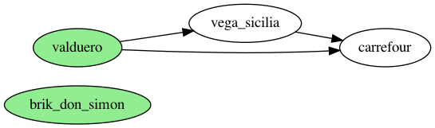
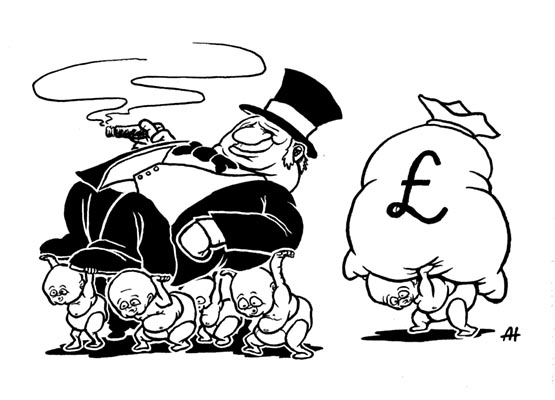

## Overview

Hay muchos problemas donde hay más de una dimensión a optimizar y las dimensiones no se pueden comparar fácilmente entre sí.

Por ejemplo, si compramos un vino nos interesa encontrar un vino que tenga buen sabor y bajo coste, pero no está claro como comparar las dimensiones de sabor y coste entre sí: cuantas "unidades de sabor" equivalen a 1 euro?

Este tipo de problemas se llaman [problemas de optimización multiobjetivo](https://en.wikipedia.org/wiki/Multi-objective_optimization).

Cuando hay varias dimensiones, la intuición cruda probablemente nos va a llevar a decisiones malas. En estas situaciones, vale la pena:
1. pintar una matriz de **opciones x dimensiones** para juntar en un sitio todos los datos
2. pensar en la [pareto dominancia](https://en.wikipedia.org/wiki/Pareto_efficiency) (o una aproximación): esto es una forma de formalizar la intuición de que si una opción **a** es mejor en alguna dimensión y no peor en las demás que una opción **b**, la opción **a** es superior. Aunque no siempre podamos comparar todas las opciones posibles entre sí, sí que **podemos descartar todas aquellas opciones que están pareto-dominadas por otras**
3. una vez descartadas las opciones no pareto eficientes, escoger entre las restantes

* [Ejemplo](#ejemplo)
* [Ejercicio](#ejercicio)
  * [1 Pareto dominancia](#1-pareto-dominancia)
  * [2 frontera de Pareto](#2-frontera-de-pareto)
  * [3 escoger proveedor de cloud](#3-escoger-proveedor-de-cloud)
    * [a](#a)
    * [b](#b)
    * [c](#c)

## Ejemplo

Queremos escoger un vino. Los vinos los evaluamos en 2 dimensiones, el precio y el sabor. *NB: no tengo ni idea de vinos*.

Lo primero es pintar la tabla de **opciones x dimensiones** para tener todos los datos relevantes a mano:

| marca | precio | sabor |
| ----- | ------ | ----- |
| valduero | 3.7 € | 7/10 |
| vega sicilia | 3.7 € | 6/10 |
| carrefour | 4.1 € | 6/10 |
| brik don simon | 55 € | 9/10 |

### Pintamos un grafo donde los nodos son las opciones y existe una arista `a -> b` si la opción `a` pareto-domina la opción `b`

Una relación de pareto dominancia simplemente es una forma más rigurosa de aplicar el sentido común, eg.

**valduero -> vega_sicilia** porque vale lo mismo y está más bueno

**valduero -> carrefour** porque vale menos y está más bueno

**vega_sicilia -> carrefour** porque vale menos y está igual de bueno

**brik_don_simon** no tiene relación de pareto-dominancia con los demás, ya que es mejor en una dimensión que todos y peor en otra dimensión que todos

### Identificamos el conjunto de opciones que NO están pareto-dominadas por otras: estas opciones se llaman la frontera de pareto o el conjunto de pareto

Una vez tenemos el grafo es fácil encontrar la frontera de pareto: **valduero** y **brik_don_simon**. Los demás no están en la frontera porque están pareto dominados por otros vinos.

### escogemos entre los elementos en la frontera de pareto

Ahora habrá que ver cómo decidimos entre `valduero` y `brik_don_simon`: el criterio de pareto-dominancia no nos ayudará aquí, necesitamos otro criterio.

Por ejemplo, si somos Bill Gates probablemente nos importa más el sabor; si dormimos en la calle, probablemente el precio es más importante.

**El criterio de pareto-dominancia nos ha permitido simplificar el problema descartando `vega_sicilia` y `carrefour`**, que no es poco. Da igual que seamos Bill Gates o que durmamos en la calle: las soluciones pareto-dominadas son inferiores.

## Ejercicio

Estamos poco contentos con nuestro proveedor de cloud, **cloudisa**, y estamos evaluando otras opciones. Nuestro becario, bajo amenaza de no recibir su biberón, ha elaborado una lista de competidores a lo largo de varias dimensiones:

* cost: el coste al mes del servicio, cuanto menos mejor
* sla: el service level agreement sobre el uptime del proveedor, cuanto más mejor
* green energy: si el proveedor usa energía renovable, idealmente sí
* child labor: si el proveedor usa trabajo infantil, idealmente no

| provider | cost | sla | green energy | child labor |
| -------- | ---- | --- | ------------ | ----------- |
| cloudisa | 9.103 € | 95 % | no | yes |
| valenciana de cloud s.l | 9.081 € | 99 % | no | yes |
| cumulonimbus s.l | 9.106 € | 95 % | yes | yes |
| cirrusa | 9.081 € | 99 % | yes | yes |
| strato y cia. | 9.104 € | 99.9 % | yes | no |

### 1 Pareto dominancia

Pintar un grafo donde los nodos son las opciones y existe una arista `a -> b` si la opción `a` pareto-domina la opción `b`, aunque sea a mano alzada y foto

### 2 frontera de Pareto

Encontrar el conjunto de opciones que NO están pareto-dominadas por otras: estas opciones se llaman la [frontera de pareto o el conjunto de pareto](https://en.wikipedia.org/wiki/Pareto_efficiency#Pareto_frontier).

### 3 escoger proveedor de cloud

#### a

¿Qué opción escogerías? ¿Por qué?

#### b

¿La opción que has escogido está en la frontera de pareto?

#### c

¿La opción que has escogido pareto-domina a nuestro provider actual, cloudisa?
